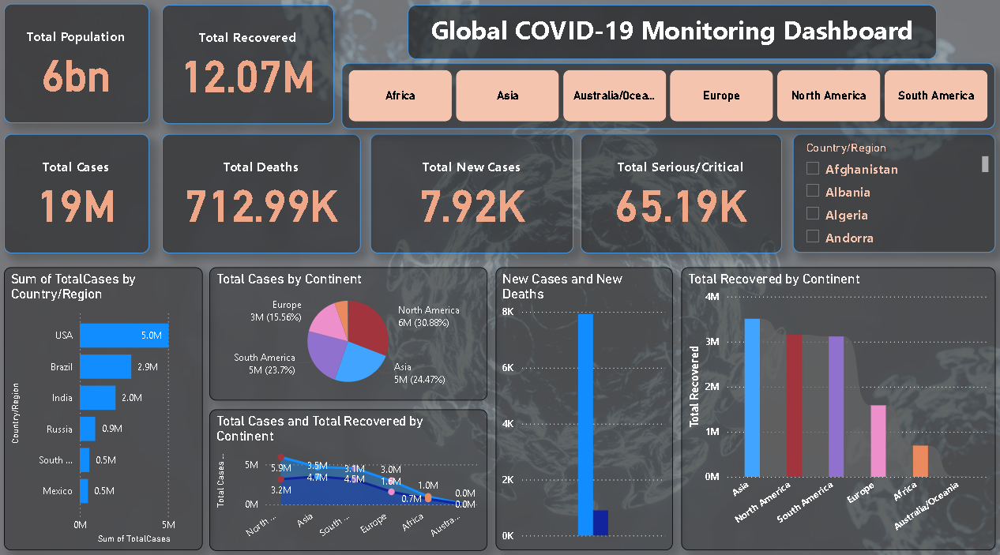

# 🦠 Global COVID-19 Monitoring Dashboard

## 📌 Project Overview
An interactive Power BI dashboard built to monitor and analyze the global spread of COVID-19 across 200+ countries. The dashboard enables continent-wise and country-level drill-downs to track key epidemiological metrics and support data-driven insights.

---

## 🛠️ Tools Used
- **Microsoft Power BI** — Dashboard design and data visualization
- **Power Query** — Data cleaning and transformation
- **DAX (Data Analysis Expressions)** — Custom measures and KPI calculations
- **Dataset:** Worldometer COVID-19 Data (worldometer_data.csv)

---

## 📊 Dashboard Features

### KPI Cards
- Total Population
- Total Cases
- Total Deaths
- Total Recovered
- Total New Cases
- Total Serious/Critical Cases

### Visualizations
- **Clustered Bar Chart** — Total Cases by Country/Region
- **Pie Chart** — Total Cases by Continent
- **Area Chart** — Total Cases vs Total Recovered by Continent
- **Line and Clustered Column Chart** — New Cases and New Deaths comparison
- **Ribbon Chart** — Total Recovered by Continent
- **Continent Slicer** — Filter by Africa, Asia, Australia/Oceania, Europe, North America, South America
- **Country/Region Slicer** — Drill down to individual countries

---

## 🔍 Key Insights
- South America accounted for **100% of cases** in the filtered view with **5M total cases** and **3.12M recoveries**
- **Brazil** led South America with **2.9M cases**, followed by Peru (0.5M) and Chile (0.4M)
- Total deaths stood at **154.89K** with **14.30K serious/critical** cases across the region
- The dashboard allows dynamic filtering by continent and country for granular analysis

---

## 🧹 Data Preparation
- Cleaned and transformed raw Worldometer data using **Power Query**
- Handled missing values and standardized column formats
- Created custom **DAX measures** for KPI calculations including recovery rate and case distribution

---

## 📁 Files in This Repository
| File | Description |
|------|-------------|
| `Global_COVID-19_Monitoring_Dashboard.pbix` | Power BI dashboard file |
| `worldometer_data.csv` | Raw dataset used for analysis |
| `COVID19_Dashboard_Preview.png` | Dashboard screenshot |
| `README.md` | Project documentation |

---

## 📬 Contact
**Pushkar Sharma**
- 📧 sharmapushkarmail@gmail.com
- 💼 [LinkedIn](https://linkedin.com/in/sharma-pushkar)
- 🐙 [GitHub](https://github.com/PushkarSharmaGit)
